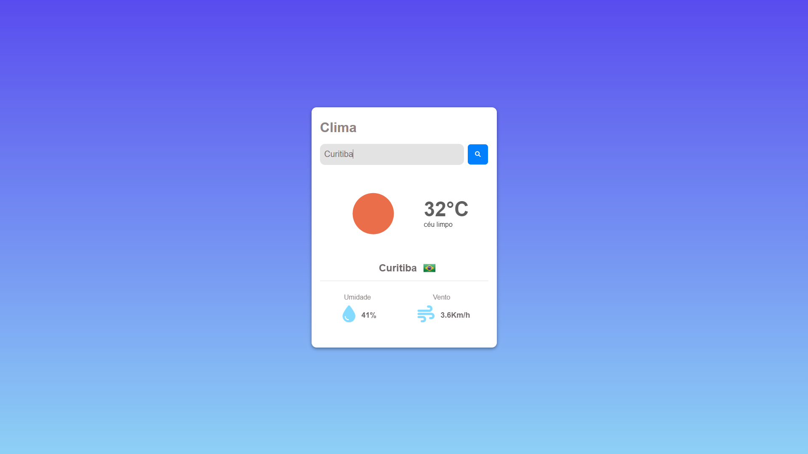
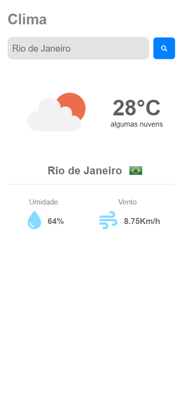

# Projeto OPEN WEATHER

<div>
    
    
</div>

<div>
    
    
</div>

## Ferramentas utilizadas
### Linguagens
- HTML;
- CSS;
- JS.

### API
- OpenWeather API:
  - Utilizada para encontrar as informações climáticas da cidade informada pelo usuário.
- flagsapi:
  - Utilizada para buscar a bandeira do país onde está localizado a cidade informada.

## Referência
Aplicação de Clima com OpenWeather API - Projeto de JavaScript com API 
```
https://www.youtube.com/watch?v=VS8EBgPwsSU&t=2552s
```